# Práctica 4.1: Introducción a CI/CD con Flask y AWS

Este repositorio contiene la entrega de la práctica de Integración Continua (CI) y Despliegue Manual en AWS. Se ha utilizado una aplicación Flask como base, añadiendo funcionalidades y tests unitarios coordinados mediante GitHub Actions.

---

## 1. Configuración de la Infraestructura en AWS
Se ha desplegado una instancia EC2 (Ubuntu 24.04) configurando los Grupos de Seguridad para permitir el tráfico necesario.

*   **Instancia EC2**: Estado en ejecución y detalles de IP pública.
*   **Security Groups**: Apertura del puerto 8000 para la aplicación Flask, además de SSH (22), HTTP (80) y HTTPS (443).

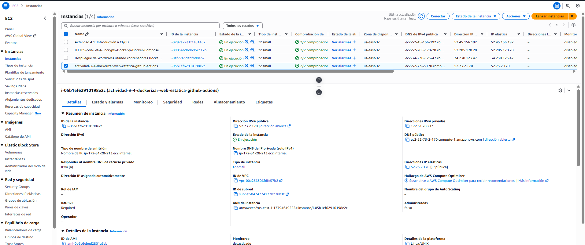
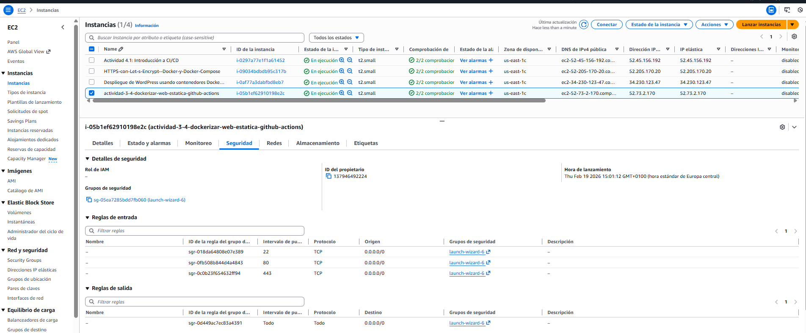
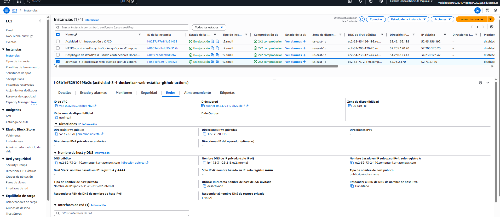

---

## 2. Proceso de Despliegue en el Servidor (SSH)
Conexión mediante SSH y preparación del entorno de ejecución siguiendo estos pasos:

1.  **Actualización del sistema** e instalación de python3-pip, python3-venv y git.
2.  **Clonación del repositorio** desde GitHub.
3.  **Configuración del entorno virtual (venv)** para aislar las dependencias.
4.  **Instalación de librerías** contenidas en requirements.txt.

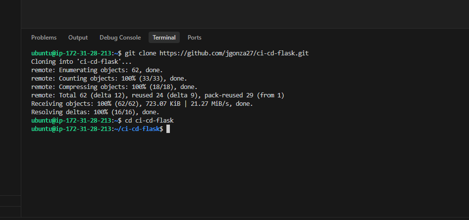
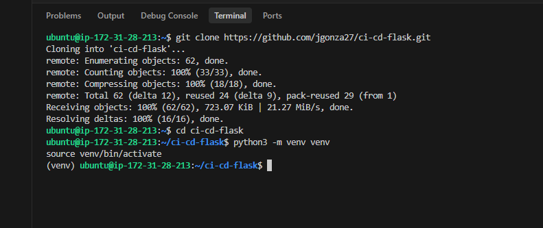
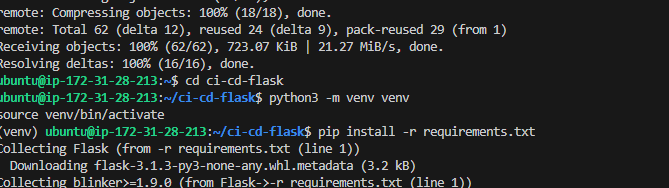

---

## 3. Servidor en Funcionamiento
Lanzamiento de la aplicación y verificación de accesibilidad externa.

*   **Ejecución**: El servidor escucha en 0.0.0.0:8000.
*   **Ruta Raíz (/)**: Retorna el mensaje "Hello, World!".
*   **Ruta de Salud (/health)**: Nueva funcionalidad añadida para monitorización.

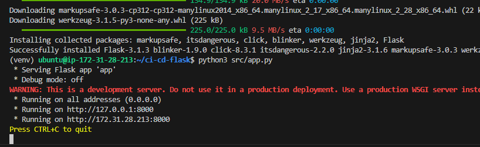
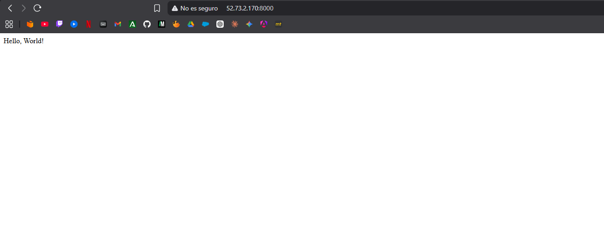
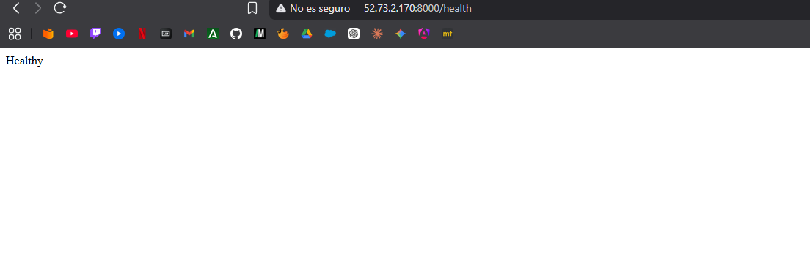

---

## 4. Integración Continua (GitHub Actions)
Se ha implementado un pipeline de CI que se dispara automáticamente en cada push o pull_request a la rama main.

### Mejoras Realizadas:
*   **Nuevos Tests**: Se han añadido tests para validar la ruta /health y el manejo de errores 404.
*   **Automatización**: Configuración de .github/workflows/ci.yml.

### Resultados de la Integración:
*   Verificación de que el workflow se completa con éxito.
*   Detalle de la ejecución de los 3 tests unitarios satisfactoriamente.

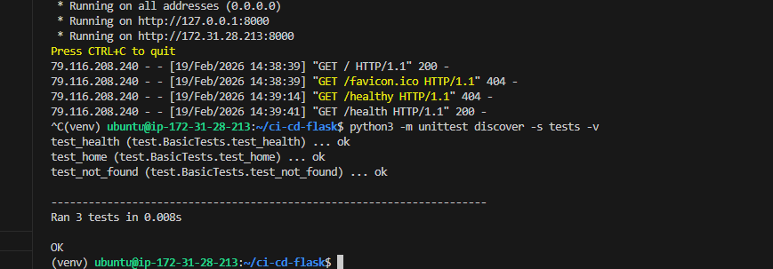
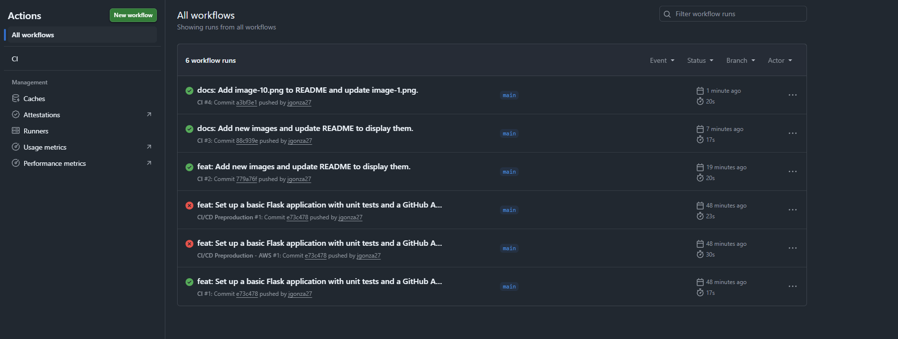
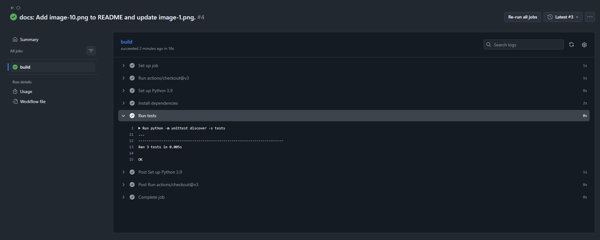

---

## 📂 Estructura del Proyecto
- src/app.py: Aplicación Flask con rutas / y /health.
- tests/test.py: Pruebas unitarias (Home, Health, 404).
- .github/workflows/ci.yml: Configuración del pipeline de Integración Continua.
- requirements.txt: Dependencias del proyecto.
- Dockerfile: Configuración para contenedorización (opcional).